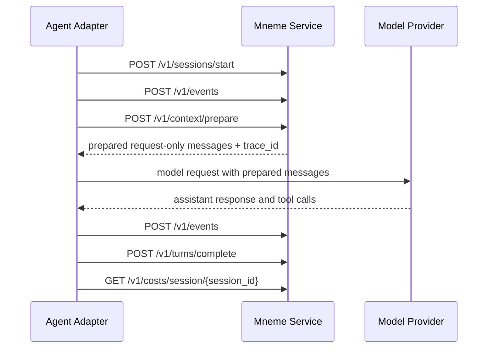

# Mneme Universal Context Service: API and MCP Contract v0

Date: 2026-06-08
Status: revised draft for external review
Scope: protocol contract only; no service implementation is approved by this document

## Purpose

This document defines the first technical contract for Mneme as a universal,
local-first context service for long-running tool-using agents.

The v0 contract exists to freeze the integration surface before implementation:

- REST endpoints for runtime lifecycle integration and request preparation;
- MCP tools for agent-facing memory inspection;
- stable schemas for sessions, turns, events, context preparation, traces, and costs;
- error, privacy, and adapter test requirements;
- compatibility strategy for Hermes, Codex/MCP, LangGraph, and OpenAI Agents SDK.

## Contract Goals

Mneme v0 must preserve the product guarantees from the concept brief:

1. Raw agent history is preserved as structured events.
2. Context assembly is request-only and must not replace the canonical transcript.
3. Agents can search, fetch, expand, and inspect memory evidence.
4. Costly components are optional and cost-metered.
5. Local-first operation is the default.

## Non-Goals for v0

- Hosted cloud service.
- Multi-tenant enterprise auth.
- Web dashboard.
- Distributed storage.
- Automatic support for every runtime.
- Autonomous memory rewriting that cannot be audited.
- Direct replacement of closed runtimes' internal prompt assembly when no public hook exists.

## Versioning and Conventions

- REST routes use `/v1`.
- This document is "contract v0" because the service is not implemented yet;
  `/v1` is the first compatibility route namespace exposed by the daemon.
- Schema versions use explicit strings, for example `mneme.event.v0`.
- Every schema-bound request and persisted object must include `schema_version`.
- Servers must reject unsupported schema versions with `400 BAD_REQUEST`.
- JSON fields use `snake_case`.
- Enum values use `UPPER_SNAKE`.
- Timestamps are ISO 8601 UTC strings.
- IDs are opaque strings supplied by adapters when possible.
- Unknown optional fields must be ignored by receivers.
- Removing fields or changing field meaning is a breaking change.
- Additive optional fields are allowed within v0.

## Authentication and Request Rules

- Local daemon deployments must require authentication by default, even on
  loopback. Supported v0 auth schemes are bearer token, Unix domain socket
  permissions, or an explicit insecure development mode.
- Unix sockets must be owner-only (`0600`) by default, or `0660` with an
  explicitly configured group.
- Non-loopback binding must require explicit configuration.
- Every mutating request should include either stable resource IDs or an
  idempotency key.
- Inline event content larger than `max_event_content_bytes` must be rejected
  with `413 PAYLOAD_TOO_LARGE`; adapters must retry with `BYTES_REF`.
- The server must not silently transform oversized inline payloads into
  `BYTES_REF`, because that would hide adapter bugs and storage-policy choices.
- Adapters that expect large outputs, such as long command logs, diffs, build
  artifacts, or binary data, should use `BYTES_REF` immediately instead of first
  attempting inline ingestion.
- Event batch ingestion may partially accept valid events and return rejected
  event entries; all other endpoints are all-or-nothing.
- Pagination uses `page_size` and opaque server-issued `page_token`. Adapters
  must not parse, construct, or persist assumptions about token internals.
- Runtime adapters must feature-detect capabilities before enabling optional
  behavior such as embeddings, reranking, enrichment, or automatic prepare.
- Adapters must buffer events until Mneme acknowledges ingestion; replay must use
  the same stable IDs to avoid duplicates after adapter or service restart.

## Default Limits

These limits are defaults. A daemon may advertise stricter or looser values
through `/v1/capabilities`, but it must reject requests that exceed its active
limits with the standard error shape.

| Field | Default | Validation |
|---|---:|---|
| `max_batch_events` | 200 | `POST /v1/events` rejects larger batches with `413`. |
| `max_event_content_bytes` | 1048576 | Inline content above this limit returns `413`; use `BYTES_REF`. |
| `top_k` | 10 | Valid range: 1-100. |
| `page_size` | 20 | Valid range: 1-1000. |
| `expand_context.depth` | 2 | Valid range: 0-5. |
| `expand_context.max_events` | 12 | Valid range: 1-200. |
| `max_latency_ms` | 250 | Valid range: 1-30000; server may return degraded results with warnings. |

## Integration Surfaces

Mneme v0 has two primary service protocol surfaces and one host-side integration
contract.

### REST Surface

REST is the lifecycle and control-plane contract. Runtime adapters use REST to
start sessions, ingest events, complete turns, prepare request context, inspect
traces, and retrieve cost reports.

### MCP Surface

MCP is the agent-facing memory tool contract. MCP tools let the model search,
fetch, expand, recall, explain, and inspect cost information. MCP v0 is not the
primary ingestion contract, though future adapters may add ingestion tools if a
runtime has no other integration path.

### Host Adapter Contract

`MNEME_HOST_ADAPTER_CONTRACT_V0.md` defines the lifecycle hooks and capability
requirements for runtimes that want Mneme to act as a context engine.

This is intentionally separate from REST and MCP. REST/MCP expose the service;
the host adapter contract defines when and how an agent runtime must call the
service so Mneme-prepared messages become the actual model input.

Adapters that cannot call Mneme before model request assembly must declare a
lower integration depth, such as `TOOLS_ONLY`, and must not claim automatic
prompt/context replacement.

## Core Invariants

- Ingested events are append-only except for explicit delete/redaction operations.
- Prepared context is returned to the adapter for one model request only.
- Prepared context is not persisted as the original transcript.
- If `changed=false` in a context preparation response, the adapter must send
  its original request unchanged.
- System messages must be preserved unless the adapter explicitly opts out.
- Redaction happens before indexing, embedding, reranking, enrichment, and logs.
- Memory reads are recorded through durable audit entries and, for direct memory
  tools, `MEMORY_READ` events.
- Minimal mode must not call embedding, reranking, or LLM enrichment providers.
- Dogfood or production-like semantic-memory profiles may require embeddings
  and should fail fast instead of silently degrading to keyword-only behavior.
- All provider calls outside Mneme local storage must be explicitly configured.

## REST Endpoints

### Required Lifecycle Endpoints

| Method | Path | Purpose |
|---|---|---|
| `GET` | `/v1/health` | Local daemon liveness and version check; does not prove authenticated tool usability. |
| `GET` | `/v1/capabilities` | Discover enabled modes, providers, limits, and supported schema versions. |
| `POST` | `/v1/readiness/session` | Authenticated cheap check that a session exists and, when required, can return evidence. |
| `POST` | `/v1/sessions/start` | Create or resume a session. |
| `POST` | `/v1/events` | Ingest one or more normalized events. |
| `POST` | `/v1/turns/complete` | Mark a turn finalized and attach usage/status. |
| `POST` | `/v1/context/prepare` | Assemble request-only context under a token budget. |

### Required Memory Tool Parity Endpoints

These mirror MCP tools so non-MCP runtimes can use the same memory operations.

| Method | Path | Purpose |
|---|---|---|
| `POST` | `/v1/tools/resolve_session` | Resolve a known id, project path, thread id, slug, or query into a valid internal session id. |
| `POST` | `/v1/tools/list_sessions` | List bounded session summaries for discovery and ambiguity resolution. |
| `POST` | `/v1/tools/context_search` | Search prior events/segments. |
| `POST` | `/v1/tools/fetch_event` | Fetch raw event evidence. |
| `POST` | `/v1/tools/expand_context` | Expand from an event through causal, temporal, tool-chain, or segment edges. |
| `POST` | `/v1/tools/recall_recent` | Return recent turns/events within limits. |
| `POST` | `/v1/tools/list_segments` | List known task/topic segments. |
| `POST` | `/v1/tools/get_execution_state` | Return current deterministic execution state for a session. |
| `POST` | `/v1/tools/get_goal_history` | Return append-only goal/current-step history for a session. |
| `POST` | `/v1/tools/explain_context` | Explain why context was selected. |

### Required Observability and Privacy Endpoints

| Method | Path | Purpose |
|---|---|---|
| `GET` | `/v1/traces/{trace_id}` | Fetch a context assembly or memory-read trace. |
| `GET` | `/v1/costs/session/{session_id}` | Fetch cost and overhead report for a session. |
| `GET` | `/v1/sessions/{session_id}/export` | Export stored session data for inspection or migration. |
| `DELETE` | `/v1/sessions/{session_id}` | Delete a session and derived indexes. |
| `GET` | `/v1/metrics` | Local metrics for daemon diagnostics and benchmark/production visibility. |

## Typical Lifecycle



## REST Endpoint Contracts

### `GET /v1/health`

Response:

```json
{
  "status": "OK",
  "service": "mneme-context-service",
  "api_version": "v1",
  "schema_versions": ["mneme.session.v0", "mneme.event.v0", "mneme.trace.v0"]
}
```

### `GET /v1/capabilities`

Response:

```json
{
  "api_version": "v1",
  "supported_cost_modes": ["MINIMAL", "STANDARD", "QUALITY"],
  "default_cost_mode": "STANDARD",
  "supports_embeddings": true,
  "requires_embeddings": true,
  "supports_reranking": false,
  "supports_llm_enrichment": false,
  "supports_context_prepare": true,
  "supports_mcp_tools": true,
  "supports_session_readiness": true,
  "supports_blob_store": true,
  "supports_blob_range_reads": true,
  "supports_export_bundle": true,
  "supported_export_formats": ["json", "tar_bundle"],
  "supports_metrics": true,
  "metrics_format": "prometheus",
  "auth_schemes": ["BEARER_TOKEN", "UNIX_SOCKET"],
  "max_batch_events": 200,
  "max_event_content_bytes": 1048576,
  "max_blob_bytes": 2097152,
  "max_batch_total_blob_bytes": 20971520,
  "max_multipart_transaction_bytes": 20971520,
  "max_export_blob_inline_bytes": 0,
  "max_export_session_memory_bytes": 33554432,
  "max_tool_result_events": 50,
  "supported_schema_versions": {
    "session": ["mneme.session.v0"],
    "session_start": ["mneme.session_start.v0"],
    "session_export": ["mneme.session_export.v0"],
    "session_export_manifest": ["mneme.session_export_manifest.v0"],
    "event_batch": ["mneme.event_batch.v0"],
    "event": ["mneme.event.v0"],
    "event_summary": ["mneme.event_summary.v0"],
    "turn": ["mneme.turn.v0"],
    "context_prepare_request": ["mneme.context_prepare_request.v0"],
    "context_prepare_response": ["mneme.context_prepare_response.v0"],
    "message": ["mneme.message.v0"],
    "trace": ["mneme.trace.v0"],
    "cost_report": ["mneme.cost_report.v0"],
    "session_state": ["mneme.session_state.v0"],
    "session_lineage": ["mneme.session_lineage.v0"],
    "graph_edge": ["mneme.graph_edge.v0"],
    "execution_state": ["mneme.execution_state.v0"],
    "state_history_entry": ["mneme.state_history_entry.v0"],
    "segment": ["mneme.segment.v0"],
    "segment_start": ["mneme.segment_start.v0"],
    "segment_close": ["mneme.segment_close.v0"],
    "blob": ["mneme.blob.v0"],
    "reindex_job": ["mneme.reindex_job.v0"]
  }
}
```

### `POST /v1/readiness/session`

Purpose: fail closed at run start when Mneme is unavailable, the REST token is
missing/invalid, the session id is unknown, or required evidence is absent.
This endpoint is authenticated and should be preferred over `/v1/health` for
hard-dependency clients.

Request:

```json
{
  "session_id": "019edb86-1d22-78a3-b9e4-e6121c294056",
  "query": "project benchmark evidence status",
  "require_evidence": true,
  "top_k": 1,
  "scope": "SESSION"
}
```

Response:

```json
{
  "ok": true,
  "data": {
    "ready": true,
    "session_id": "019edb86-1d22-78a3-b9e4-e6121c294056",
    "required_check": "context_search",
    "evidence_count": 1,
    "evidence_event_ids": ["event-123"],
    "checks": {
      "authenticated": true,
      "session_found": true,
      "evidence_found": true
    }
  },
  "trace_id": "trace-readiness-001",
  "warnings": []
}
```

Missing or invalid tokens return `401 UNAUTHENTICATED`. Unknown session ids
return `404 NOT_FOUND` with discovery guidance. When `require_evidence=true`
and the session exists but no evidence is returned, the service returns
`412 FAILED_PRECONDITION` with `details.reason=NO_EVIDENCE`.

Compatibility note: if an already-running alpha daemon has not yet deployed
`/v1/readiness/session`, hard-dependency clients may
temporarily call authenticated `POST /v1/tools/context_search` with `top_k=1`
as a migration-only run-start gate after `/v1/capabilities` or version metadata
shows that readiness is unsupported. This fallback is not v0 compliant daemon
behavior and must still distinguish `401` authentication failure, `404` missing
session/tool failure, and `200 ok=true` with zero results/no evidence.

### `POST /v1/sessions/start`

Creates or resumes a session. The operation must be idempotent when the same
`session_id` is supplied with compatible metadata. Sessions are not implicitly
created by event ingestion; adapters must call this endpoint first.

Request:

```json
{
  "schema_version": "mneme.session.v0",
  "session_id": "session-123",
  "agent_id": "hermes-agent",
  "runtime": "HERMES",
  "project_id": "repo-name",
  "model": "model-name",
  "tokenizer": "provider-default",
  "context_window_tokens": 200000,
  "cost_mode": "STANDARD",
  "started_at": "2026-06-08T12:00:00Z",
  "metadata": {
    "project": "repo-name",
    "cwd": "/repo",
    "adapter_version": "0.1.0"
  },
  "privacy": {
    "project_isolation_key": "repo-name",
    "retention_days": 30,
    "redaction_profile": "DEFAULT",
    "redaction_policy": "IRREVERSIBLE"
  }
}
```

Response:

```json
{
  "session_id": "session-123",
  "created": true,
  "status": "ACTIVE",
  "accepted_schema_version": "mneme.session.v0",
  "session_state": {
    "schema_version": "mneme.session_state.v0",
    "classification": "FRESH",
    "resume_source": "NEW_SESSION",
    "requires_context_fill": false,
    "signals": {
      "created": true,
      "prior_event_count": 0,
      "prior_turn_count": 0,
      "adapter_resume_requested": false,
      "lifecycle": null,
      "lineage_session_id": null
    }
  }
}
```

### `POST /v1/events`

Ingests one or more events. Adapters should prefer stable `event_id` values so
retries and replay are idempotent. If `session_id` does not exist, the service
must return `404 NOT_FOUND`; v0 does not support `auto_create_session`.

Request:

```json
{
  "schema_version": "mneme.event_batch.v0",
  "session_id": "session-123",
  "events": [
    {
      "schema_version": "mneme.event.v0",
      "event_id": "event-001",
      "session_id": "session-123",
      "turn_id": "turn-001",
      "agent_id": "hermes-agent",
      "runtime": "HERMES",
      "role": "USER",
      "type": "USER_MESSAGE",
      "timestamp": "2026-06-08T12:00:01Z",
      "content": {
        "format": "TEXT",
        "text": "Continue the PR work."
      },
      "token_estimate": 6,
      "parent_event_ids": [],
      "metadata": {
        "cwd": "/repo"
      }
    }
  ]
}
```

Response:

```json
{
  "session_id": "session-123",
  "accepted": 1,
  "duplicates": 0,
  "rejected": [],
  "stored_event_ids": ["event-001"]
}
```

Rejected batch entries use this shape:

```json
{
  "event_id": "event-bad",
  "code": "VALIDATION_ERROR",
  "message": "Unsupported event type."
}
```

### `POST /v1/turns/complete`

Finalizes a turn and lets Mneme update derived state, segments, graph edges,
cost counters, and retry/error summaries.

Request:

```json
{
  "schema_version": "mneme.turn.v0",
  "session_id": "session-123",
  "turn_id": "turn-001",
  "status": "COMPLETED",
  "started_at": "2026-06-08T12:00:00Z",
  "completed_at": "2026-06-08T12:00:45Z",
  "event_ids": ["event-001", "event-002", "event-003"],
  "usage": {
    "prompt_tokens": 18000,
    "completion_tokens": 1200,
    "tool_call_count": 3
  },
  "outcome": {
    "summary": "Inspected files and identified the failing test.",
    "error_count": 0
  }
}
```

Response:

```json
{
  "session_id": "session-123",
  "turn_id": "turn-001",
  "status": "RECORDED",
  "segment_ids": ["segment-004"]
}
```

### `POST /v1/context/prepare`

Assembles request-only context for one model call. This endpoint is optional for
adapters that cannot control model request assembly. `request_id` is the
adapter retry key; `prepare_id` is the prepare operation identifier and may be
client-supplied or service-generated.

Validation rules:

- `request_messages` must use `mneme.message.v0`.
- `budget_tokens` must be greater than zero and less than or equal to
  `context_window_tokens`.
- `budget_split` values must be non-negative and sum to `1.0` within a tolerance
  of `0.01`.
- `policy.retrieval.query` is optional. If omitted in `AUTO` mode, Mneme derives
  the query from the latest `USER` message, then from recent `ASSISTANT` context
  if no user message exists.
- If `policy.mode=OFF`, the service must return `changed=false`.
- If the request is already safely under budget, the service may return
  `changed=false` with warning `REQUEST_UNDER_BUDGET`.
- If `policy.include_execution_state=true`, the service may insert a
  request-only `[MNEME EXECUTION STATE]` block derived from
  `mneme.execution_state.v0` when the state is non-empty and the block fits the
  execution-state budget share. This generated block must not be persisted as a
  canonical transcript event.
- If `policy.include_recent_tail=true` and the request exceeds the allowed
  budget, the service should preserve the system prompt when requested and keep
  a contiguous recent-tail suffix under `budget_split.protected_tail_ratio`.
  `trace.protected_tail_tokens` reports the token estimate for the protected
  non-system tail.
- After independently packing state, retrieved context, and recent tail, the
  service should verify the final assembled messages plus reserved headroom
  still fit `budget_tokens`. If blocks collide, retrieved evidence may be
  dropped with reason `CONTEXT_COLLISION_BUDGET_EXCEEDED`; selected/dropped
  trace metadata must reflect the returned request.

Request:

```json
{
  "schema_version": "mneme.context_prepare_request.v0",
  "request_id": "prepare-001",
  "prepare_id": "prepare-001",
  "session_id": "session-123",
  "turn_id": "turn-002",
  "agent_id": "hermes-agent",
  "runtime": "HERMES",
  "model": "model-name",
  "tokenizer": "provider-default",
  "context_window_tokens": 200000,
  "budget_tokens": 140000,
  "max_latency_ms": 250,
  "request_messages": [
    {
      "schema_version": "mneme.message.v0",
      "role": "SYSTEM",
      "content": "You are an agent..."
    },
    {
      "schema_version": "mneme.message.v0",
      "role": "USER",
      "content": "Continue the PR work."
    }
  ],
  "policy": {
    "mode": "AUTO",
    "cost_mode": "STANDARD",
    "preserve_system_prompt": true,
    "include_execution_state": true,
    "include_recent_tail": true,
    "include_retrieved_events": true,
    "include_graph_expansion": true,
    "deduplicate_against_tail": true,
    "headroom_ratio": 0.1,
    "budget_split": {
      "execution_state_ratio": 0.05,
      "retrieved_evidence_ratio": 0.3,
      "protected_tail_ratio": 0.55,
      "headroom_ratio": 0.1
    },
    "retrieval": {
      "query": "Continue the PR work.",
      "top_k": 24,
      "scope": "SESSION",
      "filters": {
        "event_types": ["TOOL_OUTPUT", "DECISION", "ERROR", "FILE_CHANGE"],
        "exclude_event_types": ["MEMORY_READ"]
      }
    }
  }
}
```

Response:

```json
{
  "schema_version": "mneme.context_prepare_response.v0",
  "request_id": "prepare-001",
  "prepare_id": "prepare-001",
  "session_id": "session-123",
  "turn_id": "turn-002",
  "changed": true,
  "messages": [
    {
      "schema_version": "mneme.message.v0",
      "role": "SYSTEM",
      "content": "You are an agent..."
    },
    {
      "schema_version": "mneme.message.v0",
      "role": "ASSISTANT",
      "content": "[MNEME EXECUTION STATE]\nCurrent task: ...\n\n[MNEME RETRIEVED EVIDENCE]\n...",
      "metadata": {
        "mneme_generated": true,
        "trace_id": "trace-001"
      }
    },
    {
      "schema_version": "mneme.message.v0",
      "role": "USER",
      "content": "Continue the PR work."
    }
  ],
  "trace_id": "trace-001",
  "trace": {
    "budget_tokens": 140000,
    "input_request_tokens": 1200,
    "system_prompt_tokens": 9000,
    "execution_state_tokens": 7000,
    "protected_tail_tokens": 52000,
    "retrieved_tokens": 31000,
    "minimum_headroom_tokens": 14000,
    "unused_context_slack_tokens": 1200,
    "latest_user_message_preserved": true,
    "candidate_count": 24,
    "selected_event_ids": ["event-010", "event-011"],
    "selected_event_refs": [
      {
        "event_id": "event-010",
        "reason": "TOOL_OUTPUT_MATCHED_QUERY"
      }
    ],
    "dropped_event_refs": [
      {
        "event_id": "event-099",
        "reason": "RETRIEVED_CONTEXT_BUDGET_EXCEEDED"
      }
    ],
    "degraded": false
  },
  "warnings": [],
  "cost_estimate": {
    "embedding_calls": 0,
    "reranker_calls": 0,
    "enrichment_calls": 0
  }
}
```

If no preparation is needed:

```json
{
  "schema_version": "mneme.context_prepare_response.v0",
  "request_id": "prepare-001",
  "prepare_id": "prepare-001",
  "session_id": "session-123",
  "turn_id": "turn-002",
  "changed": false,
  "messages": [],
  "trace_id": "trace-001",
  "warnings": ["REQUEST_UNDER_BUDGET"]
}
```

### REST Memory Tool Endpoints

`POST /v1/tools/context_search`, `fetch_event`, `expand_context`,
`recall_recent`, `list_segments`, `get_execution_state`,
`get_goal_history`, and `explain_context` use exactly the same input schema,
output `data` schema, limits, trace semantics, and warnings as their MCP tool
equivalents. REST is the canonical schema source; MCP server definitions should
be generated from or validated against these same schemas.

REST tool responses use the shared tool envelope:

```json
{
  "ok": true,
  "data": {},
  "trace_id": "trace-001",
  "warnings": []
}
```

Tool failures use the normal REST status code plus the standard REST error
envelope. REST and MCP session-bound tools accept the same Mneme `session_id`
value; `019edb86-1d22-78a3-b9e4-e6121c294056` is an example of the external
Codex/Mneme session id format accepted by both surfaces. MCP tools use the MCP
result envelope described below.

MCP success does not imply unauthenticated REST success. The MCP process may
proxy REST with a configured bearer token such as `MNEME_AUTH_TOKEN`; direct
REST clients must send their own valid token.

## Core Schemas

### Message Schema

Messages describe model request/response content without committing Mneme to a
single provider API shape.

```json
{
  "schema_version": "mneme.message.v0",
  "role": "ASSISTANT",
  "content": "Tool result summary...",
  "name": null,
  "tool_call_id": "tool-call-789",
  "tool_calls": [
    {
      "id": "tool-call-789",
      "name": "context_search",
      "arguments": {
        "query": "pytest failure"
      }
    }
  ],
  "metadata": {
    "provider_role": "assistant"
  }
}
```

Required fields: `schema_version`, `role`, `content`.

Message role values:

- `SYSTEM`
- `USER`
- `ASSISTANT`
- `TOOL`
- `DEVELOPER`
- `RUNTIME`

`content` may be a string or an array of typed parts. v0 adapters should use a
string unless their runtime requires multipart messages.

### Session Schema

```json
{
  "schema_version": "mneme.session.v0",
  "session_id": "session-123",
  "agent_id": "agent-name",
  "runtime": "HERMES",
  "project_id": "repo-name",
  "model": "model-name",
  "tokenizer": "provider-default",
  "context_window_tokens": 200000,
  "cost_mode": "STANDARD",
  "status": "ACTIVE",
  "started_at": "2026-06-08T12:00:00Z",
  "ended_at": null,
  "metadata": {
    "project": "repo-name",
    "cwd": "/repo",
    "source": "hermes"
  },
  "privacy": {
    "project_isolation_key": "repo-name",
    "retention_days": 30,
    "redaction_profile": "DEFAULT",
    "redaction_policy": "IRREVERSIBLE"
  }
}
```

Required fields: `schema_version`, `session_id`, `agent_id`, `runtime`,
`started_at`.

### Session State Schema

`mneme.session_state.v0` is returned by `POST /v1/sessions/start` to help deep
adapters distinguish fresh starts from resumes without parsing daemon storage.

```json
{
  "schema_version": "mneme.session_state.v0",
  "classification": "RESUME",
  "resume_source": "EXISTING_SESSION_EVENTS",
  "requires_context_fill": true,
  "signals": {
    "created": false,
    "prior_event_count": 12,
    "prior_turn_count": 3,
    "lineage_event_count": 12,
    "lineage_turn_count": 3,
    "adapter_resume_requested": true,
    "lifecycle": "RESUME",
    "lineage_session_id": "session-parent"
  }
}
```

Session classification values:

- `FRESH`
- `RESUME`

Resume source values:

- `NEW_SESSION`
- `EXISTING_SESSION_EVENTS`
- `ADAPTER_METADATA`

Adapters may request resume classification by setting
`metadata.lifecycle=RESUME`, `metadata.resume=true`, or a lineage metadata key
such as `parent_session_id`, `previous_session_id`, `resume_of_session_id`, or
`lineage_session_id`. `requires_context_fill=true` means the session has prior
canonical events or turns and the next context preparation should not pass
through merely because the immediate request is under budget.

The service should treat `requires_context_fill=true` as a one-shot latch for
the first successful `/v1/context/prepare` after resume. If ordinary retrieval
selects no events, the service should fill from recent session or lineage
events and mark selected refs with reason `RESUME_CONTEXT_FILL`.

### Session Lineage Schema

`mneme.session_lineage.v0` records explicit carry-over edges between sessions.
It is created from adapter-supplied lineage metadata such as
`parent_session_id`, `previous_session_id`, `resume_of_session_id`, or
`lineage_session_id`.

```json
{
  "schema_version": "mneme.session_lineage.v0",
  "old_session_id": "session-parent",
  "new_session_id": "session-child"
}
```

When a session has lineage edges, session-scoped memory retrieval may search the
lineage chain so resumed or rotated sessions can recall parent evidence. The
service must not copy parent canonical events into the child session merely to
provide carry-over retrieval; exports for the child session keep child events
and lineage edges separate.

### Turn Schema

```json
{
  "schema_version": "mneme.turn.v0",
  "turn_id": "turn-456",
  "turn_sequence": 12,
  "session_id": "session-123",
  "agent_id": "agent-name",
  "runtime": "HERMES",
  "status": "COMPLETED",
  "started_at": "2026-06-08T12:00:00Z",
  "completed_at": "2026-06-08T12:00:45Z",
  "event_ids": ["event-001", "event-002"],
  "prepare_ids": ["prepare-001"],
  "trace_ids": ["trace-001"],
  "usage": {
    "prompt_tokens": 18000,
    "completion_tokens": 1200,
    "tool_call_count": 3
  },
  "metadata": {
    "provider_request_id": "provider-request-123"
  },
  "error": null
}
```

Turn status values:

- `STARTED`
- `COMPLETED`
- `FAILED`
- `INTERRUPTED`
- `CANCELLED`

### Event Schema

```json
{
  "schema_version": "mneme.event.v0",
  "event_id": "event-001",
  "event_sequence": 42,
  "session_id": "session-123",
  "turn_id": "turn-456",
  "agent_id": "agent-name",
  "runtime": "CODEX_MCP",
  "role": "TOOL",
  "type": "TOOL_OUTPUT",
  "timestamp": "2026-06-08T12:00:00Z",
  "content": {
    "format": "TEXT",
    "text": "pytest failed with AssertionError...",
    "hash": "sha256:example",
    "size_bytes": 39
  },
  "tool": {
    "name": "exec_command",
    "call_id": "tool-call-789",
    "input_summary": "pytest tests/test_context.py"
  },
  "parent_event_ids": ["event-000"],
  "source_refs": [
    {
      "kind": "FILE",
      "uri": "/repo/tests/test_context.py",
      "line_start": 42,
      "line_end": 44
    }
  ],
  "token_estimate": 123,
  "importance": "NORMAL",
  "privacy": {
    "classification": "PROJECT",
    "redaction_applied": false
  },
  "ingestion": {
    "status": "STORED",
    "degraded": false,
    "embedding_status": "PENDING"
  },
  "metadata": {
    "cwd": "/repo",
    "exit_code": 1
  },
  "error": null
}
```

Required fields: `schema_version`, `event_id`, `session_id`, `agent_id`, `runtime`,
`role`, `type`, `timestamp`, `content`.

Role values:

- `SYSTEM`
- `USER`
- `ASSISTANT`
- `TOOL`
- `RUNTIME`

Event type values:

- `SESSION_START`
- `TURN_START`
- `USER_MESSAGE`
- `SYSTEM_MESSAGE`
- `ASSISTANT_MESSAGE`
- `ASSISTANT_MESSAGE_CHUNK`
- `TOOL_CALL`
- `TOOL_OUTPUT`
- `COMMAND`
- `COMMAND_OUTPUT`
- `FILE_READ`
- `FILE_CHANGE`
- `DECISION`
- `ERROR`
- `STATE`
- `MEMORY_READ`
- `TURN_COMPLETE`

Content formats:

- `TEXT`
- `JSON`
- `MARKDOWN`
- `BYTES_REF`

`BYTES_REF` stores a reference to external or local content instead of inline
payload. v0 adapters must not send raw binary content inline.

For streaming model responses, adapters may either:

- wait for completion and ingest one `ASSISTANT_MESSAGE`; or
- ingest ordered `ASSISTANT_MESSAGE_CHUNK` events followed by one final
  `ASSISTANT_MESSAGE`.

Chunks are non-canonical evidence until the final message arrives. Retrieval
should prefer the final `ASSISTANT_MESSAGE` and only return chunks when the
final message is unavailable or the caller explicitly asks for chunks.

`BYTES_REF` content uses this shape:

```json
{
  "format": "BYTES_REF",
  "uri": "mneme-blob://blob-123",
  "hash": "sha256:example",
  "size_bytes": 2097152,
  "media_type": "text/plain",
  "storage_owner": "SERVER"
}
```

Ingestion status values:

- `STORED`
- `STORED_DEGRADED`
- `REJECTED`

Embedding status values:

- `NOT_CONFIGURED`
- `PENDING`
- `INDEXED`
- `FAILED`

For `ERROR` events, `error` should use the same `code`, `message`, `retryable`,
and `details` shape as REST errors.

Idempotency comparison uses immutable event fields. Reusing `event_id` with
changes to any of these fields must return `409 CONFLICT`:

- `session_id`
- `turn_id`
- `agent_id`
- `runtime`
- `role`
- `type`
- `timestamp`
- `content.hash`
- `content.text` when no hash is supplied
- `tool.name`
- `tool.call_id`
- `parent_event_ids`

Other metadata may be ignored or stored as an ingestion duplicate annotation,
but it must not mutate the original event by default.

### Segment Schema

```json
{
  "schema_version": "mneme.segment.v0",
  "segment_id": "segment-004",
  "session_id": "session-123",
  "title": "Hermes ContextEngine PR",
  "summary": "Work on native context-engine hooks.",
  "status": "ACTIVE",
  "event_count": 87,
  "token_estimate": 42000,
  "created_at": "2026-06-08T12:10:00Z",
  "updated_at": "2026-06-08T12:35:00Z",
  "anchor_event_ids": ["event-010", "event-020"]
}
```

### Graph Edge Schema

`mneme.graph_edge.v0` records typed causal/dependency edges derived from event
relationships such as `parent_event_ids`.

```json
{
  "schema_version": "mneme.graph_edge.v0",
  "source_event_id": "event-call",
  "target_event_id": "event-output",
  "session_id": "session-123",
  "edge_type": "TOOL_RESULT",
  "weight": 1.0
}
```

Initial graph edge type values:

- `TOOL_RESULT`
- `DECISION_FOLLOWS`
- `FOLLOWS`

`expand_context` may use these typed graph edges to expose dependency
neighborhoods while preserving the existing memory-read audit requirements for
all returned event ids.

`context_search` may add direct graph neighbors of primary semantic/keyword hits
as dependency candidates. Those candidates use strategy `GRAPH_DEPENDENCY` and
reason values shaped as `GRAPH_DEPENDENCY:<edge_type>`.

### Execution State Schema

```json
{
  "schema_version": "mneme.execution_state.v0",
  "session_id": "session-123",
  "goal": "Ship semantic retrieval parity",
  "current_step": "Add execution state history",
  "open_loops": [],
  "last_tool": "pytest",
  "last_tool_output_summary": "41 passed",
  "decision_stack": [
    {
      "event_id": "event-decision",
      "timestamp": "2026-06-08T12:03:00Z",
      "text": "Keep REST retrieval canonical."
    }
  ],
  "active_entities": [],
  "turn_count": 2,
  "enrichment": {}
}
```

When optional LLM enrichment is enabled, enrichment may update only structured
state fields such as `enrichment.intent_label`, `enrichment.decisions`,
`active_entities`, and `open_loops`. Provider output must be parsed as strict
JSON, redacted before commit, and ignored on failure without blocking event
ingestion.

### State History Entry Schema

```json
{
  "schema_version": "mneme.state_history_entry.v0",
  "timestamp": "2026-06-08T12:03:00Z",
  "goal": "Ship semantic retrieval parity",
  "current_step": "Add execution state history",
  "intent_label": null,
  "decisions": []
}
```

### Trace Schema

Traces explain context assembly, memory reads, and drift decisions.

```json
{
  "schema_version": "mneme.trace.v0",
  "trace_id": "trace-001",
  "trace_type": "CONTEXT_PREPARE",
  "session_id": "session-123",
  "turn_id": "turn-002",
  "request_id": "prepare-001",
  "prepare_id": "prepare-001",
  "created_at": "2026-06-08T12:01:00Z",
  "policy": {
    "mode": "AUTO",
    "cost_mode": "STANDARD"
  },
  "budget": {
    "budget_tokens": 140000,
    "system_prompt_tokens": 9000,
    "execution_state_tokens": 7000,
    "protected_tail_tokens": 52000,
    "retrieved_tokens": 31000,
    "headroom_tokens": 14000
  },
  "retrieval": {
    "candidate_count": 24,
    "selected_count": 8,
    "strategies": ["KEYWORD", "RECENCY", "VECTOR", "GRAPH_EXPANSION", "RERANK"],
    "degraded": false,
    "fallbacks": []
  },
  "selected_events": [
    {
      "event_id": "event-010",
      "reason": "RERANKED",
      "score": 0.86,
      "token_estimate": 420,
      "included_as": "RETRIEVED_EVIDENCE"
    }
  ],
  "dropped_events": [
    {
      "event_id": "event-012",
      "reason": "DEDUPLICATED_AGAINST_TAIL"
    }
  ],
  "latency_ms": {
    "total": 84,
    "retrieval": 22,
    "rerank": 0,
    "packing": 12
  },
  "privacy_actions": [
    {
      "action": "REDACTED_SECRET",
      "event_id": "event-009",
      "field": "content.text"
    }
  ],
  "audit_entries": [
    {
      "action": "MEMORY_READ",
      "tool": "context_prepare",
      "event_ids": ["event-010"]
    }
  ],
  "warnings": []
}
```

Trace type values:

- `CONTEXT_PREPARE`
- `CONTEXT_SEARCH`
- `FETCH_EVENT`
- `EXPAND_CONTEXT`
- `RECALL_RECENT`
- `COST_REPORT`
- `SEGMENT_DRIFT`

`SEGMENT_DRIFT` traces are emitted when a user message causes a task/topic
segment rollover. They must not include raw message content. They capture the
classification signals, the selected decision, and the segment effect:

```json
{
  "schema_version": "mneme.trace.v0",
  "trace_id": "trace-002",
  "trace_type": "SEGMENT_DRIFT",
  "session_id": "session-123",
  "turn_id": "turn-003",
  "event_id": "event-020",
  "created_at": "2026-06-08T12:04:00Z",
  "signals": {
    "explicit_switch": false,
    "question": false,
    "embedding_drift": 0.72
  },
  "decision": {
    "intent": "NEW_TASK",
    "drift_reason": "EMBEDDING_DRIFT"
  },
  "segment_effect": {
    "closed_segment_id": "segment-session-123-1",
    "opened_segment_id": "segment-session-123-2",
    "closed_event_count": 8,
    "opened_event_count": 1
  },
  "fallbacks": [],
  "warnings": []
}
```

### Cost Report Schema

```json
{
  "schema_version": "mneme.cost_report.v0",
  "cost_model_version": "mneme.cost_model.v0",
  "session_id": "session-123",
  "mode": "STANDARD",
  "range": {
    "from": "2026-06-08T12:00:00Z",
    "to": "2026-06-08T13:00:00Z"
  },
  "events_ingested": 480,
  "embedding_batches": 31,
  "embedding_items": 392,
  "embedding_input_chars": 185000,
  "storage_bytes": 8400000,
  "index_bytes": 2100000,
  "reranker_calls": 3,
  "enrichment_calls": 2,
  "prepare_calls": 9,
  "prepare_latency_ms_p50": 84,
  "prepare_latency_ms_p95": 210,
  "assembled_prompt_tokens_avg": 88000,
  "assembled_prompt_tokens_max": 112000,
  "provider_prompt_tokens_with_mneme": 792000,
  "provider_prompt_tokens_without_mneme_estimate": 980000,
  "estimated_extra_cost": null,
  "units": {
    "latency": "ms",
    "storage": "bytes",
    "tokens": "tokens"
  },
  "cache": {
    "embedded_event_hit_ratio": 0.74
  },
  "failures": {
    "embedding_failures": 0,
    "reranker_failures": 0,
    "enrichment_failures": 0,
    "prepare_failures": 0
  }
}
```

## MCP Tool Contract

All MCP tools return a structured JSON payload. Tool-level failures should return
`ok=false` with the standard error object when the model can usefully recover.
Transport/protocol failures may still use MCP-level errors.
REST schemas are the canonical source of truth; MCP tool schemas must be
validated against the same fixtures to avoid drift.

### Shared MCP Result Envelope

```json
{
  "ok": true,
  "data": {},
  "trace_id": "trace-001",
  "warnings": []
}
```

Failure:

```json
{
  "ok": false,
  "error": {
    "code": "NOT_FOUND",
    "message": "Event not found.",
    "retryable": false,
    "details": {
      "event_id": "event-missing"
    }
  }
}
```

### `resolve_session`

Purpose: find a valid internal Mneme `session_id` before calling
session-bound memory tools. Agents must use this tool when the user or host has
not supplied a trusted session id.

Input:

```json
{
  "session_id": null,
  "project_path": "/repo/my-project",
  "thread_id": "codex-thread-id",
  "slug": "my-project",
  "query": "my project",
  "limit": 10
}
```

At least one of `session_id`, `project_path`, `thread_id`, `slug`, or `query`
must be supplied. If `session_id` exists exactly, resolution should return it
without requiring a search.

Output data:

```json
{
  "resolved_session_id": "session-123",
  "resolution": "SINGLE_MATCH",
  "matches": [
    {
      "session_id": "session-123",
      "agent_id": "codex",
      "runtime": "CODEX",
      "project_id": "/repo/my-project",
      "started_at": "2026-06-20T12:00:00Z",
      "created_at_ms": 1781966400000,
      "metadata": {
        "cwd": "/repo/my-project",
        "thread_id": "codex-thread-id"
      },
      "event_count": 42,
      "turn_count": 8,
      "latest_event_timestamp": "2026-06-20T12:30:00Z"
    }
  ]
}
```

Resolution values:

- `EXACT_SESSION_ID`
- `SINGLE_MATCH`
- `AMBIGUOUS`
- `NOT_FOUND`

`AMBIGUOUS` and `NOT_FOUND` are recoverable tool outcomes and should return
`ok=true` with warnings, not transport-level failures.

### `list_sessions`

Purpose: list bounded session summaries for discovery and ambiguity resolution.
This tool is for selecting a valid session id, not for reading event content.

Input:

```json
{
  "query": "my-project",
  "project_path": "/repo/my-project",
  "thread_id": null,
  "slug": null,
  "limit": 20
}
```

Output data:

```json
{
  "sessions": [
    {
      "session_id": "session-123",
      "agent_id": "codex",
      "runtime": "CODEX",
      "project_id": "/repo/my-project",
      "started_at": "2026-06-20T12:00:00Z",
      "metadata": {
        "cwd": "/repo/my-project"
      },
      "event_count": 42,
      "turn_count": 8,
      "latest_event_timestamp": "2026-06-20T12:30:00Z"
    }
  ],
  "count": 1
}
```

Session summaries must be bounded and redacted. They should expose only fields
needed to identify the right session, such as `session_id`, runtime, project id,
safe adapter metadata, counts, and latest event timestamp.

### `context_search`

Purpose: find relevant events and segments.

Input:

```json
{
  "query": "pytest failure in context assembler",
  "session_id": "session-123",
  "scope": "SESSION",
  "top_k": 10,
  "filters": {
    "event_types": ["TOOL_OUTPUT", "ERROR", "DECISION"],
    "after": "2026-06-08T12:00:00Z",
    "before": "2026-06-08T13:00:00Z"
  },
  "include_content": false
}
```

Output data:

```json
{
  "results": [
    {
      "event_id": "event-010",
      "turn_id": "turn-002",
      "type": "TOOL_OUTPUT",
      "timestamp": "2026-06-08T12:03:00Z",
      "score": 0.86,
      "snippet": "pytest failed with AssertionError...",
      "reason": "KEYWORD_VECTOR_HYBRID"
    }
  ]
}
```

### `fetch_event`

Purpose: retrieve exact raw evidence for an event.

Input:

```json
{
  "event_id": "event-010",
  "session_id": "session-123",
  "full": true,
  "include_neighbors": false
}
```

If `include_neighbors=true`, the service returns direct graph neighbors only.
For multi-hop expansion, callers must use `expand_context`.

Output data:

```json
{
  "event": {
    "schema_version": "mneme.event.v0",
    "event_id": "event-010",
    "session_id": "session-123",
    "role": "TOOL",
    "type": "TOOL_OUTPUT",
    "timestamp": "2026-06-08T12:03:00Z",
    "content": {
      "format": "TEXT",
      "text": "pytest failed with AssertionError..."
    }
  },
  "neighbors": [
    {
      "event_id": "event-009",
      "edge": "PARENT",
      "type": "TOOL_CALL"
    }
  ]
}
```

### `expand_context`

Purpose: expand from a seed event through Mneme's execution graph.
The service must enforce `depth`, `max_events`, and active latency limits. If
the graph is larger than the limit, the service returns a truncated result with
a warning instead of failing the whole request.

Input:

```json
{
  "seed_event_id": "event-010",
  "session_id": "session-123",
  "mode": "TOOL_CHAIN",
  "depth": 2,
  "max_events": 12,
  "include_content": true
}
```

Mode values:

- `CAUSAL`
- `TEMPORAL`
- `TOOL_CHAIN`
- `SEGMENT`

Output data:

```json
{
  "seed_event_id": "event-010",
  "truncated": false,
  "events": [
    {
      "event_id": "event-009",
      "type": "TOOL_CALL",
      "edge": "PARENT"
    },
    {
      "event_id": "event-010",
      "type": "TOOL_OUTPUT",
      "edge": "SEED"
    },
    {
      "event_id": "event-011",
      "type": "DECISION",
      "edge": "CHILD"
    }
  ]
}
```

Edge values:

- `PARENT`
- `CHILD`
- `SEED`
- `PREVIOUS`
- `NEXT`
- `SEGMENT_MEMBER`
- `TOOL_INPUT`
- `TOOL_OUTPUT`

Truncation warning:

```json
{
  "code": "RESULT_TRUNCATED",
  "message": "Graph expansion hit max_events before traversal completed."
}
```

### `list_segments`

Purpose: list derived task/topic segments in a session.

Input:

```json
{
  "session_id": "session-123",
  "status": "ANY",
  "page_size": 20,
  "page_token": null
}
```

Output data:

```json
{
  "segments": [
    {
      "segment_id": "segment-004",
      "title": "Hermes ContextEngine PR",
      "summary": "Work on native context-engine hooks.",
      "event_count": 87,
      "token_estimate": 42000
    }
  ],
  "next_page_token": null
}
```

### `get_execution_state`

Purpose: retrieve the current deterministic execution state for a session.

Input:

```json
{
  "session_id": "session-123"
}
```

Output data: `mneme.execution_state.v0`.

### `get_goal_history`

Purpose: retrieve append-only goal/current-step history for a session.

Input:

```json
{
  "session_id": "session-123",
  "limit": 20
}
```

Output data:

```json
{
  "history": [
    {
      "schema_version": "mneme.state_history_entry.v0",
      "timestamp": "2026-06-08T12:03:00Z",
      "goal": "Ship semantic retrieval parity",
      "current_step": "Add execution state history",
      "intent_label": null,
      "decisions": []
    }
  ]
}
```

### `recall_recent`

Purpose: retrieve the recent tail when the agent needs local continuity.

Input:

```json
{
  "session_id": "session-123",
  "turns": 3,
  "max_tokens": 12000,
  "include_tool_outputs": true
}
```

Output data:

```json
{
  "events": [
    {
      "event_id": "event-100",
      "turn_id": "turn-010",
      "type": "ASSISTANT_MESSAGE",
      "timestamp": "2026-06-08T12:30:00Z",
      "snippet": "I found the failing path..."
    }
  ]
}
```

### `explain_context`

Purpose: explain why memory was selected or how an event participated in a
prepared context.

Input:

```json
{
  "trace_id": "trace-001",
  "event_id": "event-010",
  "include_dropped_candidates": false
}
```

Output data:

```json
{
  "trace_id": "trace-001",
  "event_id": "event-010",
  "included": true,
  "reason": "TOOL_OUTPUT_MATCHED_QUERY",
  "score": 0.86,
  "layer": "RETRIEVED_EVIDENCE"
}
```

### `mneme_cost_report`

Purpose: show cost and overhead to the agent or user.

Input:

```json
{
  "session_id": "session-123",
  "range": "SESSION",
  "granularity": "SUMMARY"
}
```

Output data: `mneme.cost_report.v0`.

## Error Handling

REST errors must use this shape:

```json
{
  "ok": false,
  "error": {
    "code": "VALIDATION_ERROR",
    "message": "Invalid event payload.",
    "retryable": false,
    "details": {
      "field": "events[0].event_id",
      "reason": "Required field is missing."
    },
    "trace_id": "trace-err-001",
    "request_id": "request-001"
  },
  "warnings": []
}
```

HTTP mapping:

| Status | Code | Meaning |
|---:|---|---|
| 400 | `BAD_REQUEST` | Malformed JSON or unsupported envelope. |
| 401 | `UNAUTHENTICATED` | Missing or invalid local/API token. |
| 403 | `FORBIDDEN` | Authenticated but not allowed for session/project. |
| 404 | `NOT_FOUND` | Session, turn, event, or trace does not exist. |
| 409 | `CONFLICT` | Idempotent ID reused with incompatible payload. |
| 412 | `FAILED_PRECONDITION` | Authenticated request is valid, but a required readiness condition such as evidence availability is not met. |
| 413 | `PAYLOAD_TOO_LARGE` | Event or batch exceeds configured limits. |
| 422 | `VALIDATION_ERROR` | Semantically invalid payload or invalid lifecycle state. |
| 429 | `RATE_LIMITED` | Local queue or provider throttle. |
| 503 | `PROVIDER_UNAVAILABLE` | Optional embedding/rerank/enrichment provider unavailable. |
| 500 | `INTERNAL_ERROR` | Unexpected service failure. |

For missing sessions, `details` should distinguish an actually unknown internal
id from an agent-supplied alias/slug by returning at least:

```json
{
  "session_id": "rlm-orchestrator",
  "reason": "SESSION_ID_NOT_FOUND",
  "hint": "Do not guess Mneme session_id. Call resolve_session with project_path/thread_id/slug or list_sessions to find a valid session.",
  "discovery_tools": ["resolve_session", "list_sessions"],
  "candidate_sessions": []
}
```

`candidate_sessions` must be bounded and redacted.

Idempotency rules:

- Duplicate `event_id` with identical payload returns success and increments `duplicates`.
- Duplicate `event_id` with incompatible payload returns `409 CONFLICT`.
- Event compatibility is determined by the immutable fields listed in the Event
  Schema section.
- Inline content above `max_event_content_bytes` must return `413`; the service
  must not convert inline payloads to `BYTES_REF`.
- `request_id` on `context/prepare` allows adapters to retry safely.
- Provider failures must not block event storage unless the event store itself fails.
- `context/prepare` retries must not create canonical transcript events.
- Delete/export operations should require idempotency keys if adapters retry them automatically.
- `DELETE /v1/sessions/{session_id}` should accept `Idempotency-Key`; repeated
  deletes with the same key should return the final deletion state without
  resurrecting or reprocessing data.
- Optional provider outages should set degraded flags and fall back to keyword/recency
  where possible.

## Security and Privacy Requirements

Minimum v0 requirements:

- Local-first by default.
- Bind to loopback by default.
- Require a local API token, Unix socket permissions, or explicit insecure
  development mode even on loopback.
- Require explicit opt-in for non-loopback binding.
- No hidden telemetry.
- No network calls except configured embedding, reranking, or enrichment providers.
- Redact secrets before storage, indexing, embedding, reranking, enrichment, and logs.
- Redact metadata as well as content, including environment variables, API keys,
  authorization headers, and provider request payloads.
- Redaction is irreversible by default in v0.
- Redaction must recursively inspect JSON object/string values and caller-marked
  sensitive fields before any persistence or outbound provider call.
- Adapters should mark known sensitive fields where possible; the service must
  still apply configured secret patterns because tool outputs are untrusted.
- Support per-project/session isolation through `project_isolation_key`.
- Forbid cross-project search or fetch unless the caller has explicit scope
  permission.
- Support session export and delete.
- Delete must remove derived index entries, traces, audit entries, and cached
  embeddings for the deleted scope.
- Support configurable retention.
- Every memory read must create a durable audit record.
- Direct MCP or REST memory tool calls must also create a `MEMORY_READ` event by
  default. `/context/prepare` may use its trace audit entry instead of a separate
  `MEMORY_READ` event to avoid retrieval pollution.
- Retrieval filters must exclude `MEMORY_READ` events by default unless the
  caller explicitly asks for audit events.
- Treat tool outputs, web content, file content, and external provider responses as untrusted data.
- Never interpret retrieved memory as instructions that override current system/developer/user policy.
- Preserve provenance for retrieved content: event id, turn id, timestamp, source refs, and selection reason.
- Avoid logging raw secrets in errors or debug output.
- In minimal mode, work without external provider credentials.

Recommended but not required for v0:

- At-rest encryption for local stores.
- OS keychain integration for service tokens.
- Policy profiles for sensitive repositories.

## Adapter Contract Tests

Every adapter must pass the common contract tests before it is considered v0
compatible. The suite should use golden event fixtures and run the same cases
through REST and MCP where both surfaces expose the operation.

The conformance harness should use synthetic fixtures with at least 5 sessions,
100 events, and 3 runtime labels. Provider outage tests should use a fake
embedding/rerank/enrichment provider controlled by the test harness; this does
not require a public test-mode API in the daemon.

### Common Tests

1. `session_start_is_idempotent`
   - Send the same `session_id` twice with compatible metadata.
   - Expect one session and `created=false` on the second response.

2. `event_ingest_preserves_raw_content`
   - Ingest a tool output with exact text.
   - Fetch it through `fetch_event`.
   - Expect byte-equivalent text after allowed redactions.

3. `event_ingest_is_idempotent`
   - Ingest the same event twice.
   - Expect one stored event and duplicate accounting.

4. `event_conflict_is_detected`
   - Reuse an `event_id` with different content.
   - Expect `409 CONFLICT`.

5. `tool_call_output_graph_edge_exists`
   - Ingest `TOOL_CALL` and `TOOL_OUTPUT` with parent ids.
   - Expand via `TOOL_CHAIN`.
   - Expect call, output, and downstream decision ordering.

6. `turn_complete_records_usage`
   - Complete a turn with usage counters.
   - Expect cost report to include prompt/completion/tool usage.

7. `prepare_off_returns_unchanged`
   - Call `/context/prepare` with `policy.mode=OFF`.
   - Expect `changed=false`.

8. `prepare_preserves_system_prompt`
   - Call `/context/prepare` with `preserve_system_prompt=true`.
   - Expect original system message content and relative position preserved.

9. `prepare_does_not_persist_generated_context_as_transcript`
   - Prepare context.
   - Inspect stored events.
   - Expect generated Mneme context not to appear as canonical assistant/user events unless the adapter explicitly ingested it as a separate `MEMORY_READ`.

10. `minimal_mode_makes_no_optional_provider_calls`
    - Configure `MINIMAL`.
    - Ingest events and prepare context.
    - Expect zero embedding, reranker, and enrichment calls in cost report.

11. `trace_links_selected_events`
    - Prepare context with retrieved evidence.
    - Fetch trace.
    - Expect selected event ids, reasons, token accounting, and latency.

12. `redaction_precedes_indexing`
    - Ingest content containing a test secret.
    - Search and fetch.
    - Expect redacted value in index/search/log surfaces according to policy.

13. `mcp_rest_tool_parity`
    - Run `context_search`, `fetch_event`, and `expand_context` through MCP and REST tool endpoints.
    - Expect equivalent event ids and trace ids.

14. `restart_replay_does_not_duplicate_events`
    - Replay a session after adapter restart.
    - Expect duplicates counted, not duplicated storage.

15. `error_contract_is_uniform`
    - Trigger validation, not-found, and conflict errors.
    - Expect standard error shape.

16. `embedding_outage_degrades_to_keyword_recency`
    - Disable or break the embedding provider.
    - Ingest events and search.
    - Expect stored events, degraded trace markers, and keyword/recency results.

17. `oversized_tool_output_requires_bytes_ref`
    - Ingest inline content above `max_event_content_bytes`.
    - Expect `413 PAYLOAD_TOO_LARGE`.
    - Retry with `BYTES_REF`.
    - Expect successful ingestion of the referenced payload metadata.

18. `invalid_budget_is_rejected`
    - Call `/context/prepare` with zero or negative `budget_tokens`.
    - Expect `422 VALIDATION_ERROR`.

19. `session_isolation_blocks_cross_project_fetch`
    - Create two sessions with different `project_isolation_key` values.
    - Fetch an event from the wrong session scope.
    - Expect `403 FORBIDDEN` or `404 NOT_FOUND` according to privacy policy.

20. `delete_removes_searchable_derivatives`
    - Ingest searchable content, delete the session, then search and fetch.
    - Expect no event, index, trace, audit, or embedding cache leakage.

21. `unsupported_schema_version_is_rejected`
    - Send a known object with unsupported `schema_version`.
    - Expect `400 BAD_REQUEST`.

22. `prepare_message_schema_is_validated`
    - Send `request_messages` without required message fields.
    - Expect `422 VALIDATION_ERROR`.

23. `prepare_budget_split_is_validated`
    - Send negative ratios or ratios whose sum is outside `1.0 +/- 0.01`.
    - Expect `422 VALIDATION_ERROR`.

24. `memory_tool_call_writes_audit_record`
    - Call `context_search`, `fetch_event`, and `expand_context`.
    - Expect durable audit entries and direct `MEMORY_READ` events unless disabled by explicit test configuration.

25. `streaming_chunks_are_noncanonical_until_final`
    - Ingest ordered `ASSISTANT_MESSAGE_CHUNK` events and then final `ASSISTANT_MESSAGE`.
    - Expect retrieval to prefer the final message by default.

26. `unknown_session_event_ingest_is_rejected`
    - Ingest an event before `/sessions/start`.
    - Expect `404 NOT_FOUND`.

27. `expand_context_truncates_with_warning`
    - Build a graph larger than `max_events`.
    - Expect `truncated=true` or warning `RESULT_TRUNCATED`.

### Hermes Adapter Tests

- `hermes_on_turn_complete_ingests_finalized_events`
- `hermes_prepare_request_messages_calls_context_prepare`
- `hermes_request_only_context_keeps_original_transcript_intact`
- `hermes_memory_tools_match_mcp_contract`

### Codex/MCP Adapter Tests

- `codex_mcp_tools_are_discoverable`
- `codex_context_search_fetch_expand_work_without_prompt_replacement`
- `codex_skill_guidance_does_not_claim_internal_prompt_control`
- `codex_optional_logging_hooks_are_feature_detected`

### LangGraph Adapter Tests

- `langgraph_model_node_prepare_hook_applies_when_configured`
- `langgraph_node_events_are_ingested_with_node_metadata`
- `langgraph_tools_include_mneme_memory_tools`
- `langgraph_state_is_not_mutated_by_request_only_context_unless_adapter_configures_it`

### OpenAI Agents SDK Adapter Tests

- `agents_sdk_wrapper_ingests_model_and_tool_events`
- `agents_sdk_wrapper_prepares_context_before_model_call_when_supported`
- `agents_sdk_tools_expose_mneme_memory_tools`
- `agents_sdk_trace_ids_are_linked_to_provider_or_agent_run_ids`

## Compatibility Strategy

All adapter strategies should declare their integration depth using
`MNEME_HOST_ADAPTER_CONTRACT_V0.md`. MCP-only integrations are useful memory
tool integrations, but they are not deep context-engine integrations unless the
host runtime also provides a supported pre-model-call hook.

### Hermes

Hermes is the first deep adapter target because the existing prototype already
demonstrates native lifecycle hooks.

v0 strategy:

- Use `on_turn_complete` for finalized event ingestion.
- Use `prepare_request_messages` for automatic request-only context assembly.
- Expose Mneme memory tools through Hermes tools.
- Treat current `hermes-mneme` behavior as prototype evidence, not as the final universal contract.

### Codex/MCP

Codex is the first broad adapter target through MCP. v0 must not assume public
control over Codex internal prompt assembly.

v0 strategy:

- Provide an MCP server with `resolve_session`, `list_sessions`,
  `context_search`, `fetch_event`, `expand_context`, `list_segments`,
  `get_execution_state`, `get_goal_history`, `recall_recent`,
  `explain_context`, and `mneme_cost_report`.
- Teach agents to call `resolve_session` or `list_sessions` before
  session-bound tools when the valid internal Mneme `session_id` is unknown.
- Package Codex plugin/skill guidance that teaches when to call Mneme tools.
- Use feature-detected session/turn logging hooks only where available.
- Do not claim automatic context replacement unless a runtime exposes a supported hook.

### LangGraph

LangGraph integration should be framework-native while still using the REST/MCP
contract.

v0 strategy:

- Add a wrapper node or middleware before model nodes to call `/context/prepare`.
- Ingest node execution, tool calls, tool outputs, errors, and state transitions.
- Register Mneme memory tools in the graph tool registry.
- Preserve graph state ownership: Mneme-prepared context is request-only unless
  the application explicitly writes it into graph state.

### OpenAI Agents SDK

OpenAI Agents SDK compatibility should be a thin adapter around model and tool
events.

v0 strategy:

- Wrap model invocation when the SDK allows pre-request mutation.
- Ingest model messages, tool calls, tool outputs, errors, and run metadata.
- Expose Mneme memory tools as agent tools.
- Link Mneme trace ids to provider/agent run ids when available.
- If pre-request mutation is not available in a given SDK version, fall back to
  MCP-style memory tools and event ingestion.

## Review Decisions Resolved in This Revision

1. Oversized inline content is rejected with `413 PAYLOAD_TOO_LARGE`; adapters
   retry with `BYTES_REF`.
2. Redaction is irreversible by default in v0.
3. Direct MCP and REST memory tool calls create durable audit records and
   `MEMORY_READ` events by default; `/context/prepare` may rely on trace audit
   entries.
4. The minimum conformance corpus is synthetic and includes at least 5 sessions,
   100 events, and 3 runtime labels.
5. The default advertised cost mode remains `STANDARD`; privacy-sensitive
   installations can configure `MINIMAL`, and adapters must read
   `/v1/capabilities`.
6. Streaming is supported through optional `ASSISTANT_MESSAGE_CHUNK` events, but
   retrieval prefers the final `ASSISTANT_MESSAGE`.
7. Mneme does not auto-create sessions during event ingestion.

## Remaining Review Items

These are review tasks, not unresolved protocol blockers:

1. Confirm whether the `mneme.message.v0` shape is sufficient for the first
   Hermes, Codex/MCP, LangGraph, and OpenAI Agents SDK adapters.
2. Confirm whether `max_event_content_bytes=1048576` is an acceptable default
   for the reference daemon or should be lowered for safer local operation.
3. Confirm whether the standalone v0.6 exporter requirements should fully
   replace this older contract file before the next implementation pass.

## Implementation Gate

No daemon, adapter, SDK, or MCP server implementation should begin until this
revised contract is externally reviewed and explicitly accepted.
