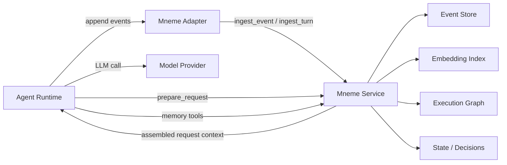
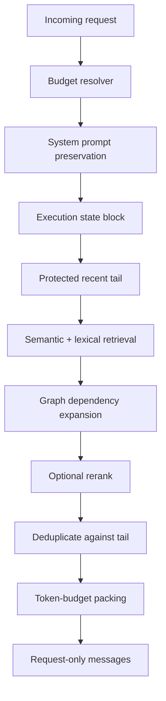

# Mneme Universal Context Service

Date: 2026-06-08
Status: concept brief

## Executive Summary

Mneme should evolve from a Hermes-specific context-engine plugin into a universal local-first context service for long-running tool-using agents.

The core idea is simple:

> Preserve raw agent event history outside the model context window, then assemble the right request-only context at inference time without destructively replacing the persisted transcript.

Most agent memory products focus on long-term user facts, preferences, or summarized memories. Mneme's stronger niche is different: it is an event-memory and context-assembly layer for agents that perform long tasks with tools, code, terminal output, files, web research, and restarts.

The intended audience is:

- agent runtime authors;
- coding-agent builders;
- teams running local/private agents;
- developers building long-running tool workflows;
- AI companies evaluating context-management approaches.

The product should not be positioned as "better chat memory." It should be positioned as:

> A universal event-context engine for agents that need to remember what happened, why it happened, and which raw evidence matters when the context window is no longer enough.

## Problem

Long-running agents accumulate far more information than a model can safely keep in its prompt:

- user instructions;
- assistant reasoning and decisions;
- tool calls;
- tool outputs;
- command logs;
- file paths;
- errors;
- retries;
- intermediate plans;
- external search results;
- restart/replay state.

The common fallback is compaction or summarization. This helps fit the prompt, but it creates several failure modes:

- important raw tool output disappears;
- summaries lose exact file paths, command outputs, ids, and edge-case evidence;
- the agent repeats searches or commands because it cannot see that they already happened;
- old decisions survive without their rationale;
- restart and replay can produce inconsistent memory;
- context bloat is treated as a prompt-size problem rather than an agent-state problem.

Mneme's thesis is that destructive compression should not be the only answer. The agent should keep a durable event log, retrieve from it, and assemble a bounded request context only when needed.

## Product Thesis

The universal Mneme service should provide four guarantees:

1. **Raw history is preserved**
   - The service stores structured events and source content without replacing the agent's canonical transcript.

2. **Context assembly is request-only**
   - The agent runtime can ask Mneme for a prepared request context, but the returned context is not persisted as the original conversation.

3. **Agents can inspect memory**
   - The runtime can expose tools such as `context_search`, `fetch_event`, `expand_context`, and `recall_recent` so the model can actively recover evidence.

4. **Costs are controllable**
   - Embeddings, reranking, and LLM enrichment must be optional or configurable. The service must degrade gracefully to SQLite + lexical/recency retrieval when expensive components are unavailable.

## Proposed Architecture

Mneme should become a standalone service with adapters for different agent runtimes.



The service should have three integration surfaces:

1. **REST/gRPC API**
   - Best for agent runtimes that can call a local or remote service.

2. **MCP server**
   - Best for agents like Codex, Claude Code, Cursor, and other MCP-capable clients.

3. **Language SDKs**
   - Thin adapters for Python and TypeScript agent runtimes.

The first public version should prioritize REST + MCP. SDKs can wrap the same protocol later.

## Core Data Model

Mneme should treat agent activity as an event stream.

### Event

```json
{
  "event_id": "stable-id",
  "session_id": "session-123",
  "turn_id": "turn-456",
  "agent_id": "agent-name",
  "role": "user|assistant|tool|system",
  "type": "user_message|assistant_message|tool_call|tool_output|decision|error|file_change",
  "content": "raw text or normalized payload",
  "tool_name": "optional",
  "tool_call_id": "optional",
  "timestamp": "2026-06-08T12:00:00Z",
  "token_estimate": 123,
  "metadata": {
    "cwd": "/repo",
    "model": "model-name",
    "source": "codex|hermes|custom"
  }
}
```

### Segment

A segment groups related events by topic, task, or drift boundary.

```json
{
  "segment_id": "seg-session-123-4",
  "session_id": "session-123",
  "title": "Hermes ContextEngine PR",
  "summary": "Work on native context-engine hooks",
  "event_count": 87,
  "token_estimate": 42000
}
```

### Execution Graph

Edges preserve causality:

- user request -> assistant tool call;
- tool call -> tool output;
- tool output -> assistant decision;
- error -> retry;
- file read -> file edit;
- previous decision -> later correction.

This is the main differentiator from flat vector memory.

## Runtime Contract

An agent runtime should integrate with Mneme through a small lifecycle contract.

### 1. Session Start

```http
POST /v1/sessions/start
```

```json
{
  "session_id": "session-123",
  "agent_id": "my-agent",
  "model": "model-name",
  "context_window_tokens": 200000,
  "metadata": {
    "project": "repo-name",
    "cwd": "/repo"
  }
}
```

### 2. Event Ingestion

```http
POST /v1/events
```

The runtime sends user messages, assistant messages, tool calls, tool outputs, errors, and important state transitions.

This can be synchronous for small agents, but production adapters should support async buffering.

### 3. Turn Completion

```http
POST /v1/turns/complete
```

```json
{
  "session_id": "session-123",
  "turn_id": "turn-456",
  "messages": ["optional shallow snapshot or event refs"],
  "usage": {
    "prompt_tokens": 18000,
    "completion_tokens": 1200
  },
  "status": "completed|failed|interrupted"
}
```

This lets Mneme update state after the turn is finalized.

### 4. Request Preparation

```http
POST /v1/context/prepare
```

```json
{
  "session_id": "session-123",
  "turn_id": "turn-789",
  "request_messages": [
    {"role": "system", "content": "..."},
    {"role": "user", "content": "Continue the PR work"}
  ],
  "budget_tokens": 140000,
  "policy": {
    "mode": "auto|force|off",
    "preserve_system_prompt": true,
    "include_recent_tail": true,
    "include_retrieved_events": true
  }
}
```

Response:

```json
{
  "changed": true,
  "messages": [
    {"role": "system", "content": "...system + memory state..."},
    {"role": "assistant", "content": "[RETRIEVED CONTEXT] ..."},
    {"role": "user", "content": "Continue the PR work"}
  ],
  "trace": {
    "budget_tokens": 140000,
    "system_prompt_tokens": 9000,
    "protected_tail_tokens": 52000,
    "retrieved_tokens": 31000,
    "candidate_count": 24,
    "selected_event_ids": ["..."]
  }
}
```

`changed=false` means the runtime should send its original request unchanged.

### 5. Agent-Facing Tools

Mneme should expose tools through MCP and SDK adapters:

- `context_search(query, scope, top_k)`
- `fetch_event(event_id, full)`
- `expand_context(seed_event_id, mode)`
- `list_segments(session_id)`
- `recall_recent(turns)`
- `explain_context(event_id | trace_id)`

The last tool is important for trust: agents and humans need to know why a memory was included.

## Request Context Assembly

Mneme should build context in layers:



Recommended default budget split:

- 5% execution state;
- 30% retrieved context;
- 55% protected recent tail;
- 10% headroom.

The exact ratios should be runtime-configurable.

## Cost and Overhead Model

Potential customers will care about cost. Mneme needs a clear answer.

### Hot Path Costs

| Component | Required | Cost Type | Notes |
|---|---:|---|---|
| SQLite event insert | yes | local CPU/disk | Cheap, should be synchronous-safe. |
| Token estimate | yes | local CPU | Cheap, approximate is acceptable. |
| Embedding generation | no, recommended | local/GPU/API | Can run in background; service degrades without it. |
| Vector search | no, recommended | local CPU/disk | `sqlite-vec` or equivalent. |
| Keyword/recency search | yes fallback | local CPU | Baseline retrieval when embeddings unavailable. |
| Reranker | optional | local/API | Should be disabled by default in low-cost mode. |
| LLM enrichment | optional | LLM/API | Already configurable in current Mneme via `llm_enrichment_enabled`. |
| Request assembly | yes when over budget | local CPU | Main cost is token counting and packing. |

### Current Prototype Evidence

Current `hermes-mneme` already has useful cost controls:

- `llm_enrichment_enabled` can disable enrichment LLM calls.
- `reranker_enabled` controls second-stage reranking.
- embedding calls are batched;
- embedding failures open a circuit breaker;
- events are still stored even if embedding fails;
- retrieval can fall back to non-embedding paths.

### Required Universal-Service Cost Modes

The universal service should define named operating modes:

#### `minimal`

- event store;
- token estimates;
- recent-tail and keyword retrieval;
- no embeddings;
- no reranker;
- no LLM enrichment.

Use case: privacy-sensitive local agents or low-budget users.

#### `standard`

- event store;
- local embeddings;
- vector + keyword hybrid retrieval;
- no LLM enrichment by default;
- optional reranker off.

Use case: local developer agents.

#### `quality`

- event store;
- local or API embeddings;
- graph expansion;
- reranker;
- periodic LLM enrichment;
- detailed traces.

Use case: enterprise agent workflows where accuracy matters more than small overhead.

### Metrics to Report

Mneme should report per-session overhead:

- events ingested;
- embedding calls;
- embedding tokens/chars;
- enrichment calls;
- reranker calls;
- request-preparation latency p50/p95;
- context assembly token budget;
- provider prompt tokens with and without Mneme;
- cache hit ratio for already-embedded events.

The service should make overhead visible instead of hiding it.

## Benchmark Plan

To attract serious attention, Mneme needs evidence. The benchmark should compare an agent with and without Mneme on tasks that naturally exceed context or require restart.

### Baselines

1. **Raw transcript until provider limit**
   - No memory service.
   - Agent relies on full conversation until context overflow.

2. **Default compaction/summarization**
   - Agent uses built-in compression.
   - Raw history may be lost or summarized.

3. **Vector memory only**
   - Store chunks and retrieve semantically.
   - No execution graph or request-only assembly.

4. **Mneme**
   - Event store + recent tail + retrieval + graph expansion + request-only assembly.

### Benchmark Scenarios

#### Scenario A: Long Coding Task

Task: modify a medium repo across many files, with failures and retries.

Measures:

- does the agent remember user constraints after compaction?
- does it remember exact files already inspected?
- does it avoid repeating failed commands?
- does it produce a correct final patch?

#### Scenario B: Tool Output Recall

Task: run multiple searches/commands, then ask about a specific result from many turns earlier.

Measures:

- exact recall of command output;
- ability to fetch raw event;
- answer grounded in retrieved evidence.

#### Scenario C: Restart / Replay

Task: stop and restart the agent mid-project.

Measures:

- duplicate ingestion rate;
- ability to continue from prior state;
- whether stale context pollutes the next request;
- whether the agent repeats completed work.

#### Scenario D: Context Overflow

Task: force context beyond 70% of model window.

Measures:

- provider prompt token stability;
- quality of assembled context;
- whether raw transcript remains intact;
- task success after multiple assemblies.

#### Scenario E: Memory Tool Use

Task: ask the agent to investigate something where relevant evidence exists in old events.

Measures:

- whether the agent calls `context_search`;
- whether it follows with `fetch_event` or `expand_context`;
- whether final answer cites recovered evidence.

### Quantitative Metrics

| Metric | Definition |
|---|---|
| Task success rate | Human/eval-graded completion. |
| Recall accuracy | Percent of required facts recovered exactly. |
| Raw evidence recovery | Whether the original event/tool output can be fetched. |
| Duplicate work rate | Repeated commands/searches already done earlier. |
| Context token usage | Provider prompt tokens over time. |
| Assembly latency | Time spent preparing request context. |
| Memory overhead | Embedding/reranker/enrichment calls per turn. |
| Restart continuity | Score after process restart. |
| Hallucinated memory rate | Claims unsupported by stored events. |

### Qualitative Evaluation

Have reviewers inspect:

- whether retrieved context is relevant;
- whether irrelevant old context distracts the agent;
- whether traces explain why events were selected;
- whether the agent can recover raw evidence on demand.

## Security and Privacy Requirements

Mneme will store sensitive agent history. The universal service must be explicit about this.

Minimum requirements:

- local-first default;
- no network calls except configured embedding/reranker/LLM providers;
- secrets redaction hooks;
- per-project/session isolation;
- export/delete controls;
- audit logs for memory reads;
- configurable memory retention;
- no hidden telemetry.

For enterprise adoption, provenance matters as much as retrieval quality.

## MVP Scope

The first universal version should be small and credible.

### In Scope

- local daemon;
- SQLite event store;
- REST API;
- MCP server exposing memory tools;
- Python adapter;
- event ingestion;
- request context preparation;
- keyword/recency fallback;
- optional embedding provider;
- trace logs;
- benchmark harness with 3-5 scripted scenarios.

### Not In Scope

- hosted cloud product;
- multi-tenant enterprise auth;
- UI-heavy product;
- automatic support for every agent framework;
- complex distributed storage;
- autonomous memory rewriting that cannot be audited.

The MVP should prove the architecture before becoming a platform.

## Adapter Strategy

### Hermes Adapter

Uses native hooks if accepted:

- `on_turn_complete`
- `prepare_request_messages`

Also exposes memory tools.

### Codex Adapter

Direct prompt assembly replacement is probably not publicly available today. Codex integration should start with:

- MCP server for `context_search`, `fetch_event`, `expand_context`, `recall_recent`;
- plugin packaging for MCP config + skills;
- hooks for session/turn logging where supported;
- a skill that teaches Codex when and how to use Mneme.

This would not replace Codex's internal memory, but it could provide an external project/event memory layer.

### LangGraph Adapter

Wrap Mneme around graph state:

- ingest node events;
- prepare context before model node;
- expose memory tools as graph tools.

### Generic OpenAI Agents SDK Adapter

Wrap model invocation:

1. send new events to Mneme;
2. call `/context/prepare`;
3. send prepared request to model;
4. ingest response/tool events.

## Competitive Positioning

Mneme should not compete head-on with generic memory products on "personalization."

Better positioning:

| Category | Typical Focus | Mneme Focus |
|---|---|---|
| Chat memory | user preferences and facts | agent work history |
| RAG | documents and knowledge bases | event transcript and tool evidence |
| Compaction | fit old conversation into summary | preserve raw history and assemble request-only context |
| Vector memory | semantic chunks | semantic + temporal + graph-aware events |
| Agent observability | traces for humans | traces that agents can retrieve and use |

## What Would Impress AI Companies

Large AI companies are unlikely to care about a Hermes-only plugin by itself. They may care about:

- a clear missing abstraction in agent runtimes;
- a working implementation;
- a benchmark showing improved continuity;
- strong safety/privacy framing;
- adapters for multiple agent systems;
- traces proving the service helps recover exact raw evidence;
- a disciplined cost model.

The strongest story is:

> "Agents need an external event-context layer, not only larger windows or destructive summaries. Mneme preserves raw operational memory and assembles bounded, auditable request context when the model needs it."

## Risks

### Retrieval Pollution

The service can retrieve irrelevant old events, including prior memory-tool calls.

Mitigation:

- trace every selected event;
- deduplicate against protected tail;
- classify tool-call/tool-output events;
- let agents fetch raw evidence explicitly.

### Cost Creep

Embeddings, reranking, and enrichment can become expensive.

Mitigation:

- named cost modes;
- local-first embeddings;
- background batching;
- circuit breakers;
- dashboards for overhead.

### Integration Friction

Each agent runtime has different lifecycle hooks.

Mitigation:

- REST API as lowest common denominator;
- MCP server for tool-facing integration;
- small reference adapters;
- a contract test suite for adapters.

### Trust and Privacy

Memory systems can become dangerous if they persist secrets or poisoned context.

Mitigation:

- local-first default;
- redaction;
- provenance;
- delete/export tools;
- human-readable event inspection.

## Recommended Next Steps

1. Create a separate design session to refine the universal API contract.
2. Decide MVP integration target: Hermes + MCP generic adapter is the strongest start.
3. Extract a small Mneme daemon from the current plugin code.
4. Add a benchmark harness with baseline vs Mneme runs.
5. Build one polished demo:
   - long agent task;
   - context overflow;
   - restart;
   - raw evidence recall.
6. Write a public README around "event memory for tool-using agents."
7. Only then think about monetization, cloud hosting, or enterprise features.

## One-Sentence Pitch

Mneme is a local-first context engine for long-running tool-using agents: it preserves raw event history, retrieves causally relevant evidence, and assembles bounded request-only context so agents can continue work without destructive compression.

